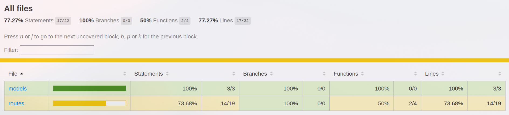

# 🎮 How Long to Beat - Game Completion Time Tracker

A full-stack web application that lets users track video games by how long they take to complete — including main story and completionist times. Built using **Node.js**, **Express**, **MongoDB**, and a clean, responsive HTML/CSS frontend.

---

## 🚀 Features

- Add new games with completion time
- Edit or delete existing entries
- Live search by name
- Filter games using A–Z navbar
- Smooth scroll and visual feedback on actions
- Box art (optional enhancement)
- RESTful API with full CRUD support

---

## 🛠 Tech Stack

- **Backend**: Node.js + Express
- **Database**: MongoDB Atlas + Mongoose
- **Frontend**: HTML + CSS + JavaScript
- **Deployment**: Render 

---

## 🌐 Live Demo

👉 [View Deployed App](https://howlongtobeat.onrender.com/)

---

## 📁 Project Structure

```
howLongToBeat/
│
├── index.js            # Main Express server
├── models/             # Mongoose schema
├── routes/             # API routes
├── public/             # Frontend (HTML, CSS, JS)
└── README.md           # Project documentation
```

---

## ⚙️ Getting Started Locally

### 1. Clone the repository

```bash
git clone https://github.com/urveeshdadhich/howLongToBeat.git
cd howLongToBeat
```

### 2. Install dependencies

```bash
npm install
```

### 3. Add your MongoDB connection string

Create a `.env` file in the root folder:

```
MONGO_URI=your_mongodb_connection_string
```

### 4. Run the server

```bash
node index.js
```

Now open: [http://localhost:5000](http://localhost:5000)

---

## 🖼 Frontend

- All frontend code is inside the `/public` folder
- Features include:
  - Add/Edit/Delete games
  - Dropdown for platform selection
  - Multiplayer toggle
  - Search bar
  - A-Z filter bar
  - Smooth scroll on edit
  - Live UI feedback

To preview it locally, open:

```
public/index.html
```

Or just drag it into your browser.

---

## 📡 API Endpoints

| Method | Endpoint           | Description         |
|--------|--------------------|---------------------|
| GET    | `/api/games`       | Get all games       |
| POST   | `/api/games`       | Add a new game      |
| PUT    | `/api/games/:id`   | Update game by ID   |
| DELETE | `/api/games/:id`   | Delete game by ID   |

---

### 📥 Sample API Request (POST)

```http
POST /api/games
Content-Type: application/json

{
  "name": "Celeste",
  "mainStoryHours": 8,
  "completionistHours": 20,
  "platform": "PC",
  "multiplayer": false
}
```

---

## 🧪 Test API with curl

### Create a game:
```bash
curl -X POST http://localhost:5000/api/games \
  -H "Content-Type: application/json" \
  -d '{"name":"Celeste","mainStoryHours":8,"completionistHours":20,"platform":"PC","multiplayer":false}'
```

### Get all games:
```bash
curl http://localhost:5000/api/games
```

### Update a game:
```bash
curl -X PUT http://localhost:5000/api/games/<game_id> \
  -H "Content-Type: application/json" \
  -d '{"name":"Celeste DX","mainStoryHours":9,"completionistHours":22,"platform":"Switch","multiplayer":false}'
```

### Delete a game:
```bash
curl -X DELETE http://localhost:5000/api/games/<game_id>
```
---

## 🧪 Testing Summary

This project is well-tested with a focus on:

- ✅ **Unit Tests** for the Mongoose model (`Game.js`)
- ✅ **Integration Tests** that verify actual database interactions
- ✅ **API Tests** to ensure CRUD endpoints function as expected

### ✅ Test Coverage
| Metric        | Coverage   |
|---------------|------------|
| Statements    | **77.27%** |
| Branches      | **100%**   |
| Functions     | **50%**    |
| Lines         | **77.27%** |

### ⚡ How to Run Tests
```bash
npm test
```

### 📊 How to Generate Coverage Report
```bash
npx jest --coverage
```

After running the above, open this file in your browser to view the detailed HTML coverage report:
```
coverage/lcov-report/index.html
```

### 📸 Screenshot

> Insert a screenshot of your test coverage report here for reference.

```markdown

```

---

## 📃 License

This project is licensed under the [MIT License](LICENSE)

---

## 👨‍💻 Author

Made with ❤️ by [Urveesh Dadhich](https://github.com/urveeshdadhich)
